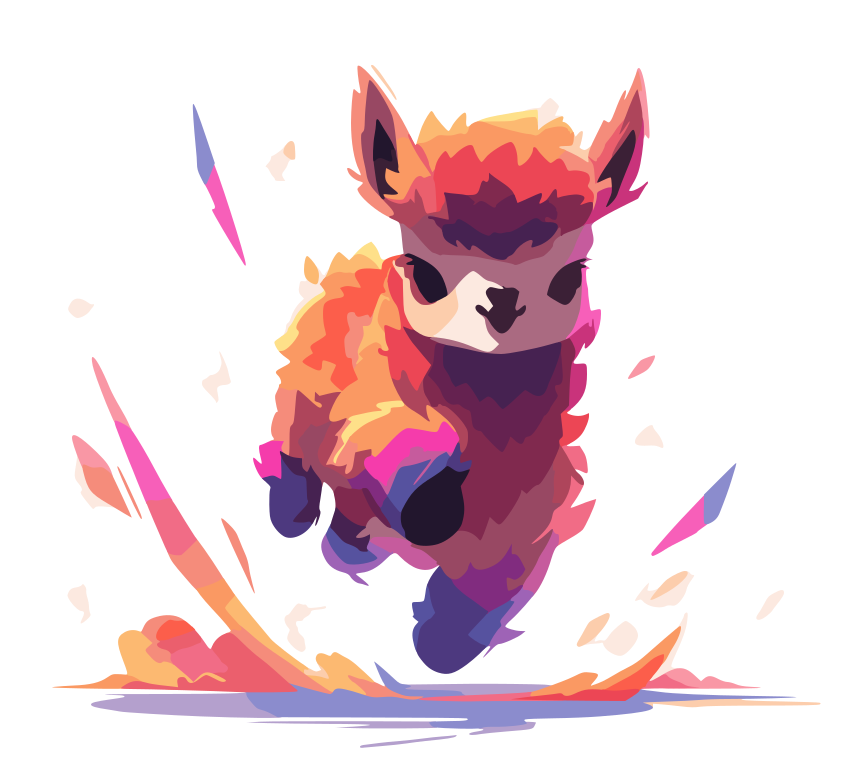

<div align=center>
  
</div>

# TinyLlama

A pedagogical implementation of TinyLlama from [TinyLlama: An Open-Source Small Language Model](https://arxiv.org/abs/2401.02385), in PyTorch.

## Usage

```python
from tinyllama import TinyLlama, TinyLlamaConfiguration

# As specified in the paper.

configuration = TinyLlamaConfiguration(
    embedding_dimension=2048,
    intermediate_dimension=5632,  # x2.75.
    number_of_heads=16,
    number_of_layers=22,
    vocabulary_size=32_000,
    context_length=2048,
)

model = TinyLlama(configuration=configuration)
tokens = torch.tensor([[1, 2, 3, 4]])
logits = model(tokens, mask=None)
```

## TODO

- [ ] Implement helper functions for GQA causal masks.
- [ ] Implement caching (RoPE, KV).
- [ ] Switch to Flash Attention 2 for GQA.
